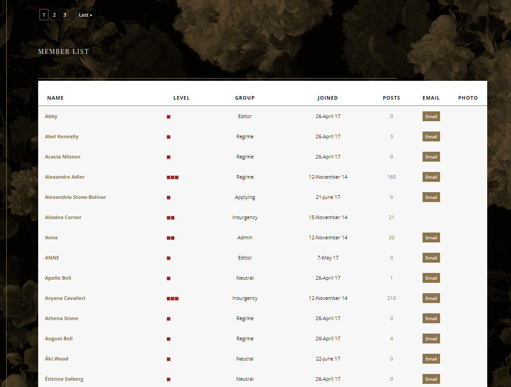
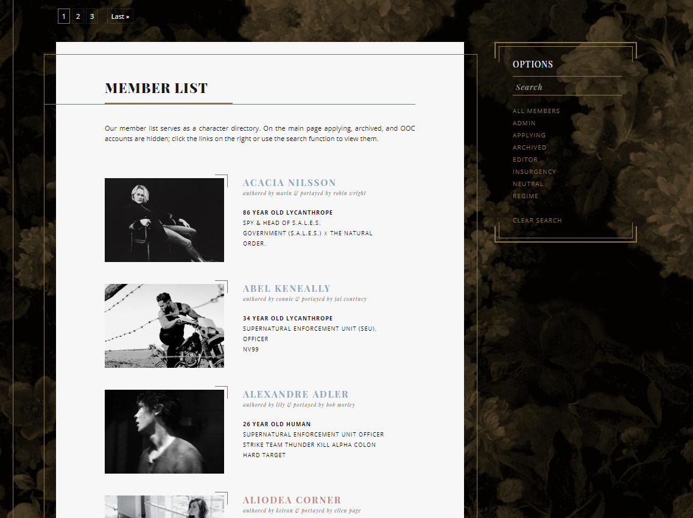

# JcInk Advanced Custom Member List

Manipulate JcInk's default /index.php?act=Members to match your site's theme using user's data.

## Table of Contents

- [JcInk Advanced Custom Member List](#jcink-advanced-custom-member-list)
  - [Table of Contents](#table-of-contents)
  - [Introduction](#introduction)
  - [Installation](#installation)
  - [Usage](#usage)
    - [CSS](#css)
    - [Custom Wrapper](#custom-wrapper)
    - [Default Member Variables](#default-member-variables)
    - [Custom Member Variables](#custom-member-variables)
    - [Custom Wrapper Initialization](#custom-wrapper-initialization)
    - [Member Initialization](#member-initialization)
  - [Example](#example)
  - [Features I'd Like to Add](#features-id-like-to-add)
  - [Known Issues](#known-issues)

## Introduction

First and foremost, this journey would not have been able to begin without Anna allowing me to test on her forum. I am so grateful for her allowing me to do so, and look forward to continuing to work with her. What a mad scientist team we will be!

Due to the multiple requests this code makes each load, the custom member list may be a little slow so please keep that in mind. I'm a novice, so if you have any ideas on how to improve this or any of the [known issues](#known-issues), please email me at [jessica@jessicastamos.com](mailto:jessica@jessicastamos.com).

Additionally, I am not the world's best at explanations so if at any time something does not make sense, you need more clarity, or are stumped, please reach out to me via email or my discord: jessikuh#8376.

## Installation

Download and host a copy of [memberlist-adv.min.js](https://raw.githubusercontent.com/jessikuh/jcink-advanced-custom-member-list/master/src/js/memberlist-adv.min.js), and place it before the closing body tag (`</body>`) of your Board Wrapper.

```html
<script src="/memberlist-adv.min.js"></script>
```

You may also use a hosted copy for free. The only caveat is that this file will likely receive the latest updates and could break your code. You can keep up with any changes by visiting the [changelog](./CHANGELOG.md). Any breaking updates (and sometimes small updates) will be shared on my [tumblr with the tag jcink-memberlist-updates](https://jessikuhcodes.tumblr.com/tagged/jcink-memberlist-updates) prior to being updated here.

```html
<script src="https://files.jcink.net/uploads/jessikuh/javascript/memberlist_adv_min.js"></script>
```

## Usage

Now begins the fun: creating your member list! I recommend having a the HTML & CSS put together first, then diving into applying the variables. There are default variables and then there are profiles you must manually set up in the HTML Templates -> Main Profile.

### CSS

Since I recommend coding your CSS and HTML first, you need to know about some of the default classes that are used. This code should be 100% customizable, so if you're stumped on why something isn't styling correctly, please reach out. I may have overlooked or forgotten some of the default classes below.

|Class|What it styles|
|-|-|
|.member-list|The container of your custom wrapper and member list.|
|.members-form|This identifies the form and shouldn't need to be styled.|
|.custom-members|The container of all the members.|
|.member-container|The container of each individual member.|
|.member-link|The link of the member's profile.|
|.member-search-input|The input field.|
|.member-search-select|The select drop down for group search/filter.|
|.member-search-links|The container of the group anchors for search/filter.|
|.member-search-link|The specific link of each group.|
|.clear-search|The wrapper of the clear search anchor.|
|.member-search-applied|This class is added whenever a search/filter is performed.|

Each .member-container and .member-search-link contains a lowercase ID of the member's group to allow you to style based on a member's group. Any space will be replaced with a hyphen and all apostrophes will be removed. If a member's group name is 'The Nerds', the ID will be 'the-nerds'.

In the case of .member-search-link, this is useful for hiding any groups you don't want or need available for search. You may also hide any member from a member group you don't want visible in your member list. If you want to show these hidden members when a search is performed, that is when the .member-search-applied class comes in handy. Below is an example of hiding a specific group from your member list and from the search, but returning them if their username contains a searched value.

```css
.custom-members #admin {
  display: none;
}

.member-search-applied .custom-members #admin {
  display: block;
}

.member-search-links #admin {
  display: none;
}
```

Below is an example of the HTML structure.

```html
<div class="member-list">
  <form class="members-form">
    YOUR WRAPPER
      <div class="members">
        <div id="GROUP-NAME" class="member-container">
          YOUR MEMBER HTML & VARIABLES
        </div>
      </div>
    END YOUR WRAPPER
  </form>
</div>
```

### Custom Wrapper

With the Advanced Custom Member List script, you can apply a custom wrapper around your member list. This allows you to add in more styling as well as a search input field, the ability to filter by groups via links or dropdown, and a clear search link. You also initialize the members in your wrapper so that the code knows the correct place to display members.

|Variable|Value returned|
|-|-|
|`{{clear-search}}`|Anchor that will return you back to the start of the member list.|
|`{{members}}`|This is where each member will appear.|
|`{{search-input}}`|The input field for user's to search.|
|`{{search-links}}`|Links for each member group to use for search/filter.|
|`{{search-select}}`|Dropdown of each member group for search/filter.|

Searches are initiated by pressing enter in the input field, selecting a group from the dropdown or clicking a group from the link. You can put a value in the input field and then select a group for a more specific search/filter.

**Note:** There's no need to use both search-links and search-select. The difference is whether you want a drop down or links. It's mostly a stylistic choice; however, using search-links provides a little more flexibility, especially ease of hiding groups that you may not want or need visible for search.

### Default Member Variables

|Variable|Value returned|
|-|-|
|`{{member-url}}`|The member's URL anchor link (HTML).|
|`{{/member-url}}`|The closing tag for the anchor link.|
|`{{name}}`|The member's name.|
|`{{group}}`|The member's group.|
|`{{posts}}`|The member's posts.|
|`{{level}}`|The member's level.|
|`{{joined}}`|The day the member joined.|

### Custom Member Variables

The way this script works is that it fetches (makes an HTTP Request of) the user's profile and returns the HTML of that page. This means we need to place an identifier on whatever fields you want to be returned in the member list. You simply need to add **id="memberList-NAME"**. Whatever you use in place of NAME will become the variable. (It is important to use memberList in correct case or else your variable will not be returned.)

For example, I would add id="memberList-face-claim" and use the variable {{face-claim}} to call it. My recommendation is to add the following at the top of your Main Profile:

```html
<!-- Member List Data -->
<span id="memberList-avatar" style="display: none;">"></span>
<span id="memberList-name" style="display: none;"><!-- |field_1| --></span>
<span id="memberList-age" style="display: none;"><!-- |field_2| --> years old</span>
<span id="memberList-played-by" style="display: none;">Played by <!-- |field_3| --></span>
<!-- End Member List Data -->
```

By following the structure above, the field will be hidden if there is no data. You can also more easily append text to accompany the variable. To access the variables above, you would use {{avatar}}, {{name}}, {{age}}, and {{played-by}}.

To initialize your custom member list, insert the code below anywhere **BEFORE** memberlist.min.js.

### Custom Wrapper Initialization

```html
<script>
  var customMemberListWrapper = '<div class="my-member-list-wrapper"><div class="position-left">{{search-input}}</div><div class="main-member-list">{{members}}</div></div>';
</script>
```

You can swap out the HTML for whatever you like as long as it is kept within the apostrophes (var customMemberListWrapper = 'STAY BETWEEN THESE APOSTROPHES').

**Important Note**: If you use an apostrophe anywhere in your customMemberList variable, it must begin with a forward slash to prevent the code from breaking.

### Member Initialization

```html
<script>
  var customMemberListWrapper = '<div class="my-member-list-wrapper"><div class="position-left">{{search-input}}</div><div class="main-member-list">{{members}}</div></div>';
  var customMemberList = '<p>{{name}}</p><p>{{group}}</p><p>{{posts}}<br />{{level}}<br />{{joined}}</p>';
</script>
```

You can swap out the HTML for whatever you like as long as it is kept within the apostrophes (var customMemberList = 'STAY BETWEEN THESE APOSTROPHES').

**Important Note**: If you use an apostrophe anywhere in your customMemberList variable, it must begin with a forward slash to prevent the code from breaking. Provided below is an example of using an apostrophe within the 'customMemberList' variable.

```html
<script>
  var customMemberListWrapper = '<div class="my-member-list-wrapper"><div class="position-left">{{search-input}}</div><div class="main-member-list">{{members}}</div></div>';
  var customMemberList = '<div class="name">{{name}}\'s Profile</div><div class="group">{{group}}</div><div class="otherData">{{posts}}<br />{{level}}<br />{{joined}}</div>';
</script>
```

## Example

From this...

to this!


Below is an outline of setting up the code.

All CSS would be placed in your style sheet.

Placed before `</body>` of the Board Wrapper:

```html
<script>
  var customMemberListWrapper = 'Your wrapper HTML, don\'t forget to use your {{members}} variable!';
  var customMemberList = 'The styling for each member.';
</script>
<script src="https://files.jcink.net/uploads/jessikuh/javascript/memberlist_min.js"></script>
```

## Features I'd Like to Add

These may or may not be added in the future.

- The ability to replace the default placeholder of 'search' for the input field.

## Known Issues

- Member list does not display alphabetically and will appear different on each load due to varying data return times.